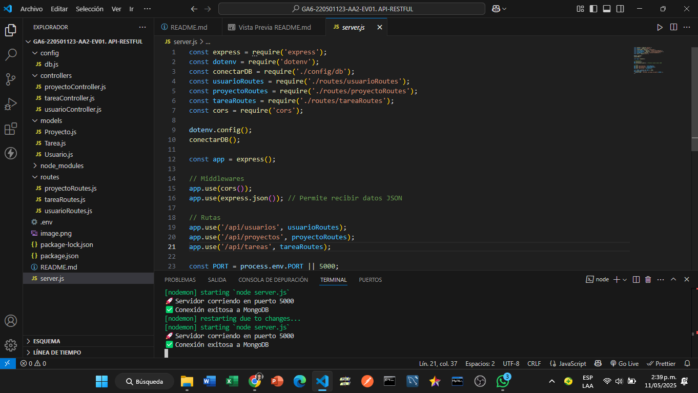

  📝 Aplicación Web - Gestión de Tareas

Grupo de Trabajo CLOUD GURUS: Dixson Sneider Cardona Acevedo, Kenny Miguel Rodríguez Madrid, María Fernanda Vega Pacheco

Técnico en Programación de Aplicaciones y Servicios para la Nube - Ficha 3070096 - Servicio Nacional de Aprendizaje (SENA)

------------------------------------------------------------------------------------------------------------


🧩 1. Introducción

    El proyecto en cuestión consiste en el desarrollo de una aplicación web para la gestión de tareas 
    y proyectos, orientada principalmente a los aprendices del SENA del programa técnico en 
    Programación de Aplicaciones y Servicios para la Nube.


📌 2. Versión 01 

    Proceso de diseño, desarrollo, configuración y prueba de una API RESTful 
    construida utilizando tecnologías modernas como Node.js, Express.js, MongoDB, Mongoose y Postman. 
    La API simula una plataforma web de gestión de tareas y proyectos, 
    y sigue una arquitectura organizada en capas bajo el patrón Modelo–Vista–Controlador (MVC).


🛠️ 3. Tecnologías Utilizadas

    Node.js: Entorno de ejecución de JavaScript del lado del servidor.
    Express.js: Framework web minimalista para construir APIs.
    MongoDB: Base de datos NoSQL orientada a documentos.
    Mongoose: ODM para modelar datos de MongoDB en Node.js.
    Postman: Herramienta para probar, documentar y automatizar APIs.
    Dotenv: Para manejar variables de entorno de forma segura.
    Bcrypt.js: Para cifrado de contraseñas.
    JWT: Para autenticación basada en tokens (pendiente de integración).


📐 4. Arquitectura y Estructura del Proyecto

    El proyecto está estructurado siguiendo el patrón MVC, facilitando su mantenibilidad y escalabilidad.

    api-restful/
    │
    ├── config/              # Configuración de conexión a MongoDB
    │   └── db.js
    ├── controllers/         # Lógica de negocio
    │   ├── usuarioController.js
    │   ├── proyectoController.js
    │   └── tareaController.js
    ├── models/              # Modelos de datos (esquemas)
    │   ├── Usuario.js
    │   ├── Proyecto.js
    │   └── Tarea.js
    ├── routes/              # Rutas de la API
    │   ├── usuarioRoutes.js
    │   ├── proyectoRoutes.js
    │   └── tareaRoutes.js
    ├── .env                 # Variables de entorno
    ├── server.js            # Punto de entrada del servidor
    ├── package.json         # Dependencias y scripts
    └── README.md





⚙️ 5. Configuración del Entorno

    5.1. Inicialización del proyecto con npm init -y.

    5.2. Instalación de dependencias:
            npm install express mongoose dotenv bcryptjs jsonwebtoken cors
            npm install --save-dev nodemon

    5.3. Archivo .env para variables sensibles:
            PORT=5001
            MONGO_URI=localhost:27017/web_gestion_tareas

    5.4. Conexión a la base de datos en config/db.js.
        

🧩 6. Modelado de Datos

    6.1. Usuario
            nombre, correo, contraseña, rol

    6.2. Proyecto
            nombre, descripcion, fechaInicio, fechaFin, estado, participantes

    6.3. Tarea
            nombre, descripcion, prioridad, estado, fechaEntrega, responsable, proyecto

    Relaciones:
            - Una tarea pertenece a un proyecto.
            - Una tarea tiene un usuario responsable.
            - Un proyecto puede tener múltiples usuarios asignados.


📡 7. Rutas REST Implementadas

    7.1. Usuarios
            | Método | Ruta              | Funcionalidad       |
            | ------ | ----------------- | ------------------- |
            | POST   | /usuarios     | Registrar usuario   |
            | GET    | /usuarios     | Listar usuarios     |
            | GET    | /usuarios/:id | Obtener por ID      |
            | PUT    | /usuarios/:id | Actualizar usuario  |
            | DELETE | /usuarios/:id | Eliminar usuario    |

    7.2. Proyectos
            | Método | Ruta                | Funcionalidad       |
            | ------ | ------------------- | ------------------- |
            | POST   | /proyectos      | Crear proyecto      |
            | GET    | /proyectos      | Listar todos        |
            | GET    | /proyectos/:id  | Obtener uno         |
            | PUT    | /proyectos/:id  | Actualizar proyecto |
            | DELETE | /proyectos/:id  | Eliminar proyecto   |

    7.3. Tareas
            | Método | Ruta                              | Funcionalidad        |
            | ------ | --------------------------------- | -------------------- |
            | POST   | /tareas                       | Crear tarea          |
            | GET    | /tareas                       | Listar todas         |
            | GET    | /tareas/proyecto/:proyectoId  | Tareas por proyecto  |
            | GET    | /tareas/:id                   | Obtener tarea por ID |
            | PUT    | /tareas/:id                   | Actualizar tarea     |
            | DELETE | /tareas/:id                   | Eliminar tarea       |


🧪 8. Pruebas con Postman

    - Se realizaron pruebas CRUD para usuarios, proyectos y tareas.
    - Se validó el flujo completo: crear usuario → crear proyecto → crear tarea vinculada.
    - Respuestas en formato JSON, con códigos de estado HTTP adecuados (201, 200, 404, 500, etc.).


🔒 9. Seguridad y Autenticación (pendiente de integración)

    - El proyecto incluye la instalación de jsonwebtoken y bcryptjs.
    - La autenticación basada en JWT será implementada para proteger rutas privadas.
    - Las contraseñas ya se almacenan cifradas con Bcrypt.


✅ 10. Conclusiones

    El desarrollo de esta API RESTful ha permitido implementar una arquitectura limpia y funcional, 
    conectada a MongoDB, con rutas separadas por entidades,modelos relacionales y 
    pruebas exitosas desde Postman. Se estableció una base sólida para una aplicación web profesional,
    que puede ampliarse con autenticación, control de permisos, validación de entradas, y más.


## 🚀 Instalación y Configuración

### Prerrequisitos
- Node.js (v14 o superior)
- MongoDB
- Git

### Pasos de instalación

1. **Clonar el repositorio**
   ```bash
   git clone https://github.com/KennyRodMad/GA6-220501123-AA2-EV01.-API-RESTFUL.git
   cd GA6-220501123-AA2-EV01.-API-RESTFUL
   ```

2. **Instalar dependencias**
   ```bash
   npm install
   ```

3. **Configurar variables de entorno**
   ```bash
   # Crear archivo .env
   PORT=5001
   MONGO_URI=mongodb://localhost:27017/web_gestion_tareas
   ```

4. **Iniciar MongoDB**
   ```bash
   mongod
   ```

5. **Ejecutar el proyecto**
   ```bash
   npm run dev
   ```

6. **Probar la API**
   - Abrir: http://localhost:5001
   - Probar endpoints con Postman

### Scripts disponibles
- `npm start` - Ejecutar en producción
- `npm run dev` - Ejecutar en desarrollo con nodemon

