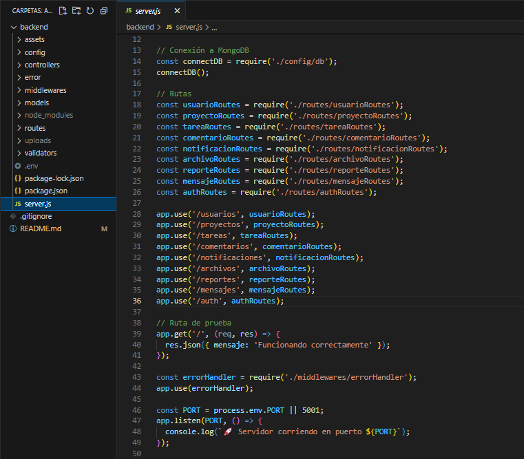

# 📝 SENAPlanner: App Web para la Gestión de Proyectos y Tareas - Backend


## 📌 1. Descripción del Backend actual

El backend de la aplicación de gestión de tareas y proyectos está completamente estructurado, seguro e integrado con un frontend moderno. 
Actualmente, cuenta con una API RESTful robusta y segura, construida con Node.js, Express.js, MongoDB y Mongoose, siguiendo el patrón Modelo–Vista–Controlador (MVC).  
Incluye autenticación JWT, cifrado de contraseñas, validación de datos, manejo de archivos, control de errores y pruebas con Postman.


## 🛠️ 2. Tecnologías Utilizadas

- **Node.js**: Entorno de ejecución JavaScript en servidor.
- **Express.js**: Framework web para APIs.
- **MongoDB**: Base de datos NoSQL.
- **Mongoose**: ODM para MongoDB.
- **Dotenv**: Variables de entorno.
- **Bcrypt.js**: Cifrado seguro de contraseñas.
- **JWT (jsonwebtoken)**: Autenticación basada en tokens.
- **Multer**: Subida y gestión de archivos.
- **Express-validator**: Validación de datos de entrada.
- **Cors**: Seguridad y control de acceso.
- **Nodemon**: Recarga automática en desarrollo.
- **Postman**: Pruebas de la API.


## 📐 4. Arquitectura y Estructura del Proyecto

El backend está organizado bajo el patrón MVC y buenas prácticas para escalabilidad y mantenibilidad.

```
backend/                         # Carpeta principal del backend
│
├── config/                      # Configuración de conexión a MongoDB
│   └── db.js
├── controllers/                 # Lógica de negocio por recurso
│   ├── usuarioController.js
│   ├── proyectoController.js
│   ├── tareaController.js
│   ├── comentarioController.js
│   ├── notificacionController.js
│   ├── archivoController.js
│   ├── reporteController.js
│   └── mensajeController.js
├── error/                       # Manejo de errores personalizados
│   └── AppError.js
├── middlewares/                 # Middlewares globales y de seguridad
│   ├── authMiddleware.js
│   ├── roleMiddleware.js
│   ├── errorHandler.js
│   └── validationHandler.js
├── models/                      # Modelos de datos (esquemas Mongoose)
│   ├── Usuario.js
│   ├── Proyecto.js
│   ├── Tarea.js
│   ├── Comentario.js
│   ├── Notificacion.js
│   ├── Archivo.js
│   ├── Reporte.js
│   └── Mensaje.js
├── routes/                      # Rutas de la API RESTful
│   ├── usuarioRoutes.js
│   ├── proyectoRoutes.js
│   ├── tareaRoutes.js
│   ├── comentarioRoutes.js
│   ├── notificacionRoutes.js
│   ├── archivoRoutes.js
│   ├── reporteRoutes.js
│   ├── mensajeRoutes.js
│   └── authRoutes.js
├── uploads/                     # Archivos subidos por los usuarios (ignorado en git)
├── validators/                  # Validadores con express-validator
│   └── usuarioValidator.js
├── .env                         # Variables de entorno en el backend (ignorado en git)
├── package.json                 # Dependencias y scripts
├── server.js                    # Punto de entrada del servidor
└── README.md                    # Documentación del Backend
```




## 🧩 6. Modelado de Datos

- **👥 Usuario:** nombre, email, contraseña (hasheada), rol, estado, preferencias.
- **📈 Proyecto:** nombre, objetivos, fechas, fases, miembros, tareas, indicadores, estado.
- **📝 Tarea:** nombre, descripción, prioridad, estado, fechaVencimiento, etiquetas, responsables, historial, comentarios, adjuntos, proyecto.
- **📥 Comentario:** usuario, tarea/proyecto, mensaje, tipo, fecha.
- **🔔 Notificación:** usuario, tipo, mensaje, leída, fecha, origen.
- **📎 Archivo:** nombre, url, tipo (pdf, docx, xlsx, png, jpg, jpeg, zip, rar), tarea/proyecto, versión, usuario, fecha.
- **📄 Reporte:** tipo, datos, usuario/proyecto, fecha.
- **💬 Mensaje:** canal (proyecto, tarea, privado), usuarios, contenido, leidoPor, fecha.

### **Relaciones clave:**
- Una tarea pertenece a un proyecto y puede tener responsables y adjuntos.
- Un comentario debe estar vinculado a una tarea o proyecto.
- Un reporte debe estar vinculado a un usuario o proyecto.
- Un archivo puede estar vinculado a una tarea o proyecto.


## 📡 7. Rutas REST Implementadas

### 7.1. Autenticación
| Método | Ruta           | Funcionalidad         |
|--------|----------------|----------------------|
| POST   | /auth/login    | Login y obtención JWT|

### 7.2. Usuarios
| Método | Ruta              | Funcionalidad       |
|--------|-------------------|--------------------|
| POST   | /usuarios         | Registrar usuario  |
| GET    | /usuarios         | Listar usuarios    |
| GET    | /usuarios/:id     | Obtener por ID     |
| PUT    | /usuarios/:id     | Actualizar usuario |
| DELETE | /usuarios/:id     | Eliminar usuario   |

### 7.3. Proyectos
| Método | Ruta                | Funcionalidad       |
|--------|---------------------|--------------------|
| POST   | /proyectos          | Crear proyecto     |
| GET    | /proyectos          | Listar todos       |
| GET    | /proyectos/:id      | Obtener uno        |
| PUT    | /proyectos/:id      | Actualizar proyecto|
| DELETE | /proyectos/:id      | Eliminar proyecto  |

### 7.4. Tareas
| Método | Ruta                              | Funcionalidad        |
|--------|-----------------------------------|----------------------|
| POST   | /tareas                           | Crear tarea          |
| GET    | /tareas                           | Listar todas         |
| GET    | /tareas/proyecto/:proyectoId      | Tareas por proyecto  |
| GET    | /tareas/:id                       | Obtener tarea por ID |
| PUT    | /tareas/:id                       | Actualizar tarea     |
| DELETE | /tareas/:id                       | Eliminar tarea       |

### 7.5. Comentarios
| Método | Ruta                | Funcionalidad        |
|--------|---------------------|----------------------|
| POST   | /comentarios        | Crear comentario     |
| GET    | /comentarios        | Listar comentarios   |
| GET    | /comentarios/:id    | Obtener por ID       |
| PUT    | /comentarios/:id    | Actualizar comentario|
| DELETE | /comentarios/:id    | Eliminar comentario  |

### 7.6. Notificaciones
| Método | Ruta                | Funcionalidad           |
|--------|---------------------|-------------------------|
| POST   | /notificaciones     | Crear notificación      |
| GET    | /notificaciones     | Listar notificaciones   |
| GET    | /notificaciones/:id | Obtener por ID          |
| PUT    | /notificaciones/:id/leida | Marcar como leída   |
| DELETE | /notificaciones/:id | Eliminar notificación   |

### 7.7. Archivos
| Método | Ruta                | Funcionalidad           |
|--------|---------------------|-------------------------|
| POST   | /archivos           | Subir archivo           |
| GET    | /archivos           | Listar archivos         |
| GET    | /archivos/:id       | Obtener archivo por ID  |
| PUT    | /archivos/:id       | Actualizar archivo      |
| DELETE | /archivos/:id       | Eliminar archivo        |

### 7.8. Reportes
| Método | Ruta                | Funcionalidad           |
|--------|---------------------|-------------------------|
| POST   | /reportes           | Crear reporte           |
| GET    | /reportes           | Listar reportes         |
| GET    | /reportes/:id       | Obtener reporte por ID  |
| DELETE | /reportes/:id       | Eliminar reporte        |

### 7.9. Mensajes
| Método | Ruta                | Funcionalidad           |
|--------|---------------------|-------------------------|
| POST   | /mensajes           | Enviar mensaje          |
| GET    | /mensajes           | Listar mensajes         |
| GET    | /mensajes/:id       | Obtener mensaje por ID  |
| PUT    | /mensajes/:id/leido | Marcar como leído       |
| DELETE | /mensajes/:id       | Eliminar mensaje        |


## 🧪 8. Pruebas con Postman

- Pruebas CRUD para todos los recursos.
- Validación de flujos completos: registro, login, creación y gestión de proyectos, tareas, comentarios, archivos, reportes y mensajes.
- Respuestas en formato JSON, con códigos de estado HTTP adecuados (201, 200, 400, 401, 404, 409, 500, etc.).


## 🔒 9. Seguridad y Buenas Prácticas

- **Autenticación JWT**: Login y protección de rutas privadas.
- **Autorización por roles**: Acceso restringido según rol (admin, instructor, aprendiz).
- **Contraseñas cifradas**: Uso de bcryptjs.
- **Validación de datos**: express-validator en endpoints críticos.
- **Manejo de errores**: Middleware global y clase AppError.
- **Gestión segura de archivos**: Multer y validación de tipos permitidos.
- **Variables sensibles**: Uso de `.env` y exclusión en `.gitignore`.


## 🚀 Instalación y Configuración

### Prerrequisitos
- Node.js (v14 o superior)
- MongoDB
- Git

### Pasos de instalación

1. **Clonar el repositorio**
   ```bash
   git clone https://github.com/KennyRodMad/Aplicacion_Web_Gestion_de_Tareas.git
   
   cd Aplicacion_Web_Gestion_de_Tareas/backend
   ```

2. **Instalar dependencias**
   ```bash
   npm install
   ```

3. **Configurar variables de entorno (crear el archivo `.env` en la carpeta backend y agregar):**
   ```bash
   PORT=5001
   MONGO_URI=mongodb://localhost:27017/web_gestion_tareas
   JWT_SECRET=SISTEMAproyectosSENA2025
   ```

4. **Crear manualmente la carpeta archivos subidos`uploads/` en la raíz de `backend/`**
   ```bash
   mkdir uploads
   ```

5. **Iniciar MongoDB**
   ```bash
   mongod
   ```

6. **Ejecutar el proyecto**
   ```bash
   npm run dev
   ```

7. **Probar la API**
   - Abrir: http://localhost:5001
   - Probar endpoints con Postman

### Scripts disponibles
- `npm start` - Ejecutar en producción
- `npm run dev` - Ejecutar en desarrollo con nodemon

